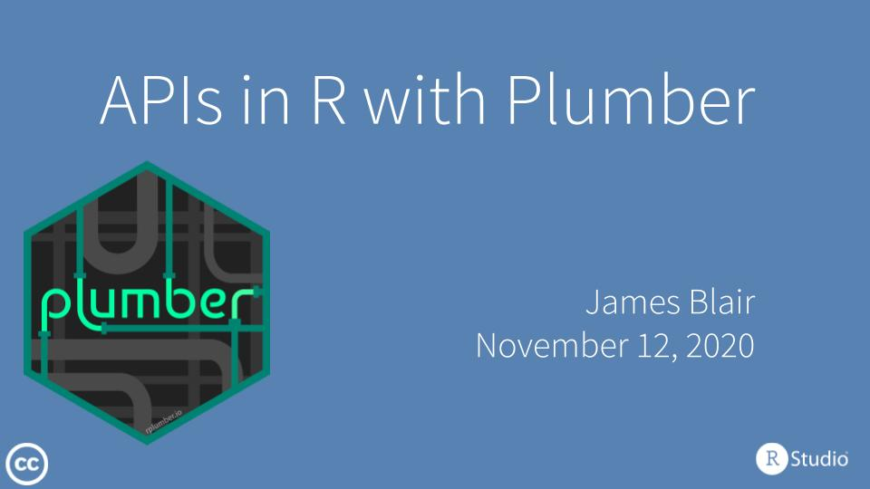

# APIs in R with Plumber

[](slides/slides.pdf)

This talk highlights using [Plumber](https://www.rplumber.io/) to solve a common set of data science problems by converting standard R code into responsive web APIs. Examples and slides are extensively borrowed from a recent [RStudio webinar on Plumber](https://github.com/blairj09-talks/plumber-webinar-2020).

## Environment

This project uses [`renv`](https://rstudio.github.io/renv/index.html) for package management. In order to install and use required packages, execute the following:

``` r
renv::restore()
```
